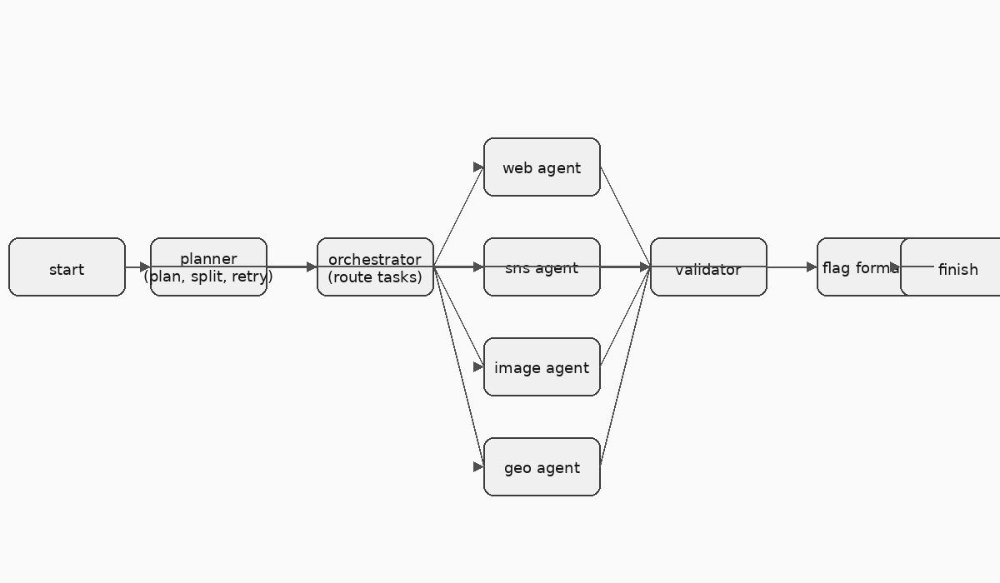

# OSINT CTF 自律解答エージェント設計書（agent.md）

## 目的

CTF（Capture The Flag）における **OSINT問題を自律的に解析・解答するAIエージェント** を開発する。

- 入力：文章、画像、URL、SNSアカウント、ユーザ名、位置情報の断片など
- 出力：
  - 推論過程（どの情報から何を調べたか）
  - 最終的なCTFフラグ候補
- 技術スタック：
  - Python
  - LangChain（Agent / Tool / Memory）
  - LLM（OpenAI / OpenRouter 等）
  - Web API / スクレイピング / 画像解析

まずは **Single Agent** で開始し、段階的に **Multi-Agent構成** に進化させる。

---

## フェーズ構成

### Phase 1：単一OSINT Agent（MVP）

#### コンテナ構成（MVP）

- ベース: python:3.11-slim
- パッケージ: uv経由で langchain, langgraph, langchain-community, httpx, pydantic, pillow, tesseract-ocr, exiftool などをインストール（必要に応じて build-arg で追加）
- 実行: `make dev` または `docker compose run --rm app bash` で開発シェル、`docker compose run --rm app python -m osinthunter.main "..."` でエージェント実行
- マウント: ソースを /app に bind mount、`.env` を環境変数として読み込み
- ネットワーク: `OSINTHUNTER_ALLOW_NETWORK=true` のときのみ外部API/検索ツールを有効化
- ログ: /app/.cache/logs に永続化（bind mount）

#### LangChain / LangGraph エージェントループ案（Phase 1.5）

- 目的: 既存の逐次ツール実行を LangGraph ベースのエージェントループに置き換え、計画 → ツール実行 → 検証 を反復可能にする。
- ノード構成（例）
  - planner (LLM): 入力を受けて tool calls の候補を生成
  - tools (LangChain Tools): text-analysis, url-investigation, sns-osint, web-search, geolocation, image-osint
  - validator (LLM): 新規 evidence を整合性チェックし、不要なら棄却
  - memory (State): EvidenceStore を LangGraph state に保持（追加のみ）
  - flagger (LLM): 終了条件時に flag{...} 抽出と信頼度ソート
- エッジ / 制御
  - planner → tools → validator → planner を最大 N ループ（max_iterations）
  - validator で終了条件: 信頼度高のフラグ候補が得られた、または探索飽和
- 出力
  - plan: planner 生成の step 群
  - evidence: state に蓄積された全 Evidence
  - flag_candidates: flag{...} / CTF 形式の候補
  - trace: LangGraph run history（再現性用）

#### LangGraph ノード構成と可視化サンプル

- ノード: `planner` → `tools` → `validator` → `flagger`（終了）とし、`validator` が継続判断をして `planner` に戻す。
- Tools は `ToolNode` に text-analysis / url-investigation / sns-osint / web-search / geolocation / image-osint を束ねる。
- State 例: `{"input": str, "plan": list, "evidence": list, "flags": list, "loop": int}`。

Jupyter / IPython での描画例（Mermaid PNG 表示）。依存: `pip install "langgraph[all]" ipython`（必要に応じ `playwright install chromium`）。

```python
from typing import TypedDict, List
from langgraph.graph import StateGraph
from langgraph.prebuilt import ToolNode
from IPython.display import Image, display


class AgentState(TypedDict):
    input: str
    plan: List[str]
    evidence: List[str]
    flags: List[str]
    loop: int


def planner_llm(state: AgentState) -> AgentState:
    # LLM で次のツール呼び出しプランを作成する想定のダミー
    return {**state, "plan": ["use text-analysis"], "loop": state.get("loop", 0) + 1}


def validator_llm(state: AgentState) -> AgentState:
    # LLM が終了条件を判定する想定のダミー
    should_stop = state.get("loop", 0) >= 3
    return {**state, "flags": state.get("flags", []) + (["flag{sample}"] if should_stop else [])}


def flagger_llm(state: AgentState) -> AgentState:
    # 終了時の出力整形を行う想定のダミー
    return state


tools = ToolNode([])  # 実際は LangChain のツール群を渡す

builder = StateGraph(AgentState)
builder.add_node("planner", planner_llm)
builder.add_node("tools", tools)
builder.add_node("validator", validator_llm)
builder.add_node("flagger", flagger_llm)

builder.add_edge("planner", "tools")
builder.add_edge("tools", "validator")
builder.add_conditional_edges(
    "validator",
    lambda s: "flagger" if s.get("flags") else "planner",
    {"flagger": "flagger", "planner": "planner"},
)

builder.set_entry_point("planner")
builder.set_finish_point("flagger")

app = builder.compile()
display(Image(app.get_graph().draw_mermaid_png()))
```

#### Agent名

**OSINT-Agent**

#### 役割

- 問題文を理解
- 必要なOSINT調査タスクを計画
- ツールを順次実行
- 情報を統合して仮説を立てる
- フラグ形式に整形して出力

#### 処理フロー

1. 入力解析（テキスト / URL / 画像）
2. 問題タイプ分類（人物特定 / 場所特定 / 時系列 / SNS追跡 など）
3. 調査計画生成（Chain of Thought）
4. ツール実行ループ
5. 仮説検証
6. フラグ生成

---

## Phase 1 Agent に組み込むツール

### 1. Text Analysis Tool

- 問題文から
  - 固有名詞
  - 時間
  - 場所
  - アカウント名
  - ドメイン を抽出

技術：

- spaCy / LLM parsing

---

### 2. Web Search Tool

- キーワード検索
- サイト限定検索
- ドメイン逆引き

技術：

- Bing Search API / SerpAPI
- LangChain Tool

---

### 3. URL Investigation Tool

- WhoIs
- DNS
- サイト構造解析
- 過去のスナップショット

技術：

- python-whois
- Wayback Machine API

---

### 4. SNS OSINT Tool

- ユーザ名横断検索
- 投稿内容解析
- 位置情報・時刻推定

対象：

- X (Twitter)
- Instagram
- GitHub
- Reddit

技術：

- 公開API / スクレイピング

---

### 5. Image OSINT Tool

- EXIF解析
- 画像内文字認識（OCR）
- 画像特徴抽出

技術：

- Pillow
- ExifTool
- Tesseract OCR
- LLM Vision

---

### 6. Geolocation Tool

- 画像・文章から位置推定
- 地名曖昧検索

技術：

- Google Maps API / OpenStreetMap

---

### 7. Memory / Evidence Store

- 調査結果を構造化保存
- 再利用可能にする

形式：

```json
{
  "source": "twitter",
  "fact": "写真は大阪駅周辺",
  "confidence": 0.8
}
```

---

## Phase 2：役割分担型マルチエージェント

### エージェント構成

#### マルチエージェント構成（LangGraph案）

- Orchestrator (LLM): 入力を解析し、サブエージェントへルーティング。進行状況と evidence を集約。
- Planner: 計画立案・タスク分解・再調査の判断（ループ制御）。
- Web Research Agent: 検索系（Bing/SerpAPI/Wayback/WHOIS）。
- SNS Agent: ハンドル横断検索と投稿解析。
- Image Agent: 画像 EXIF/OCR + 逆画像検索（外部 API による）。
- Geo Agent: 地名曖昧検索・座標リバースジオコーディング・ランドマーク照合。
- Validator: 矛盾検出・スコアリング。
- Flag Formatter: flag{...} 形式に整形。

状態管理（例）
- `state.input`: 元プロンプト
- `state.evidence`: Evidence のリスト
- `state.plan`: Planner 提案ステップ
- `state.flags`: 収集した flag 候補
- `state.trace`: 実行ログ

終了条件
- Flag Formatter が十分な信頼度のフラグを生成、またはループ上限到達。

可視化（PNG）



#### 1. Planner Agent

- 問題を分解
- 調査戦略を立案

#### 2. Web Research Agent

- Web検索・リンク探索専門

#### 3. SNS Agent

- アカウント追跡・人物特定

#### 4. Image Analysis Agent

- 画像解析・位置特定

#### 5. Validator Agent

- 情報の矛盾検出
- 仮説検証

#### 6. Flag Formatter Agent

- CTF形式に正規化

---

## エージェント間通信

- LangGraph / LangChain Multi-Agent
- JSONベースメッセージ

例：

```json
{
  "task": "analyze_image",
  "input": "image_01.jpg",
  "expected_output": "location"
}
```

---

## Phase 3：自律性強化

- ツール選択の自己最適化
- 成功/失敗ログによる改善
- CTFジャンル別プロンプト学習

---

## 非機能要件

- ログ完全保存（再現性）
- 手動介入可能（Human-in-the-loop）
- Webアプリ化（FastAPI + React）

---

## 想定ユースケース

- CTF練習用OSINTアシスタント
- 情報処理安全確保支援士（OSINT学習）
- Red Team訓練

---

## 今後の相談ポイント

- 実データ取得の法的配慮
- API制限対策
- 推論過程の可視化UI
- RAGとの統合（過去CTF問題DB）

---

## 次のアクション

1. Phase 1 Agent を LangChain で実装
2. Tool Interface 定義
3. サンプルOSINT問題で検証
4. agent.md を更新

---

（このファイルは開発の設計書として使用する）
